# 05 · Пользовательские сценарии

Диаграммы в Mermaid. Номера у сценариев — ссылочные (используются в `15-testing.md`).

## 1. Онбординг

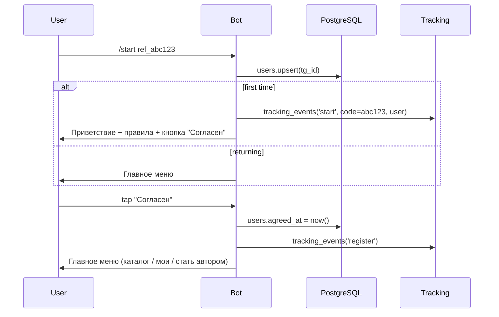

**Детали**:
- `/start` без параметра — обычный онбординг.
- `/start <code>` — парсим `code` (8 символов base62), валидируем по `tracking_codes`, пишем `tracking_events`. Если юзер новый — сохраняем `users.utm_source_code_id`.
- «Согласие с правилами» фиксируется в `users.agreed_at` (колонка добавится при необходимости — сейчас можно просто ставить наличие записи).
- Если юзер забанен (`banned_at IS NOT NULL`) — показываем только сообщение «Доступ ограничен» с причиной.

---

## 2. Становление автором (установка ника)

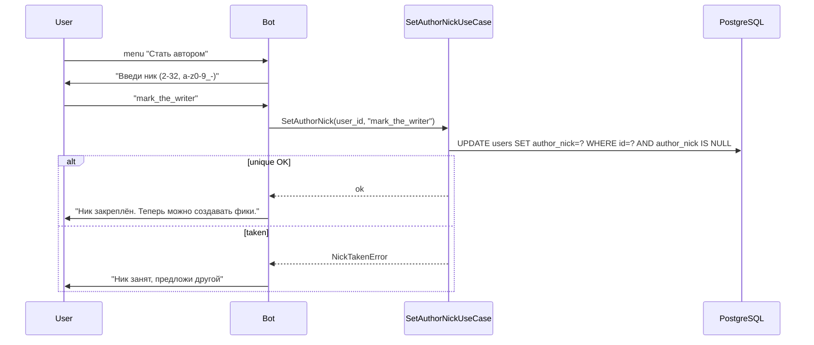

- Ник менять после установки — нельзя без обращения к модератору (политика доверия к имени автора). Если потребуется — команда `/change_nick` с подтверждением модератора.
- UNIQUE на `LOWER(author_nick)` — защита от обхода регистром.

---

## 3. Создание фанфика и глав (FSM)

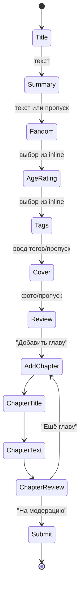

**Ключевой момент** — приём текста с форматированием:

```python
# psevdokod в author_create.py
@router.message(CreateFanfic.chapter_text)
async def on_chapter_text(message: Message, state: FSMContext, use_case: AddChapterDraftUseCase):
    cmd = AddChapterDraftCommand(
        fic_id=...,
        number=...,
        title=...,
        text=message.text or message.caption or "",
        entities=[e.model_dump() for e in (message.entities or message.caption_entities or [])],
    )
    await use_case(cmd)
```

Валидация:
- `len(text)` в UTF-16 units ≤ 100_000.
- Entities: нет `url` с `javascript:`/`data:`; `text_mention` — только на существующих юзеров (опционально: блокируем вовсе, оставляя `mention`).
- Custom emoji — разрешены.
- Лимит глав на фик — 200.

При «Сохранить черновик» — фик остаётся в `draft`, главы тоже `draft`. Возврат возможен через «Мои черновики» в профиле.

---

## 4. Публикация и модерация

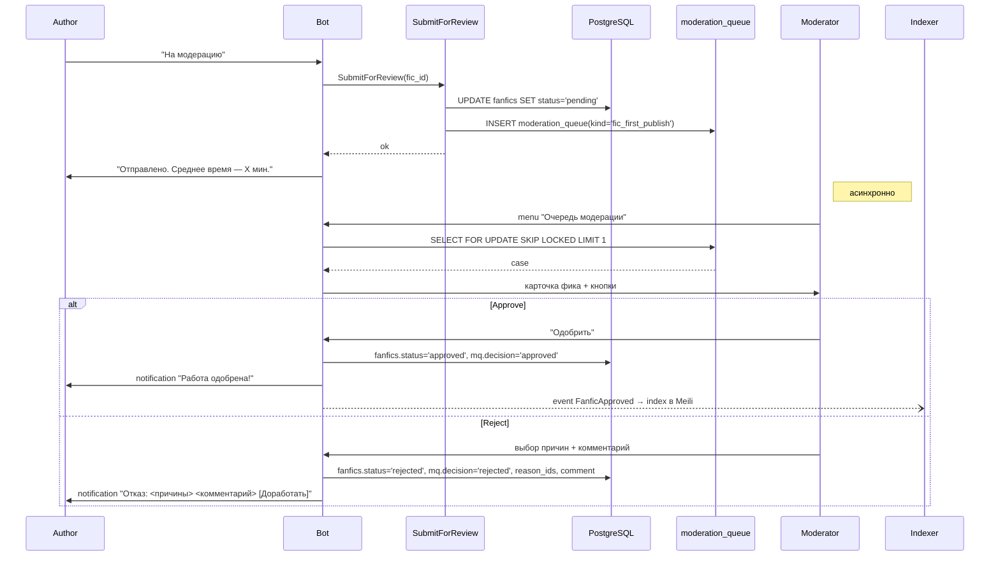

### Повторная отправка после отказа

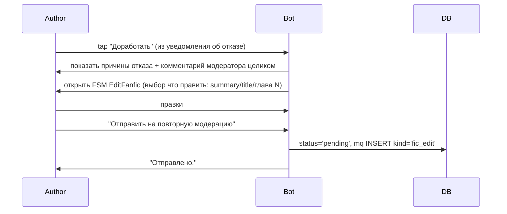

---

## 5. Чтение

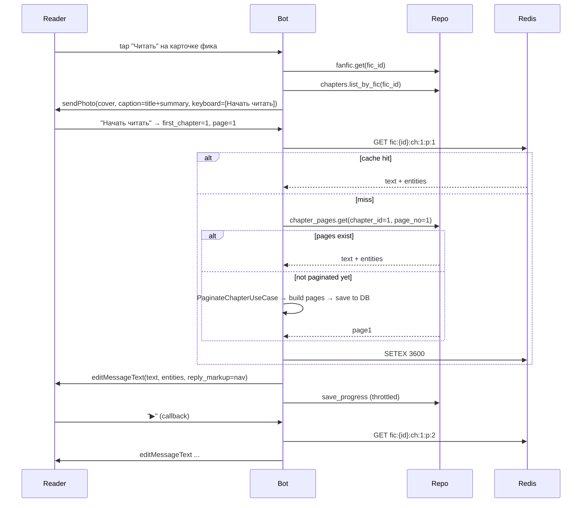

### Клавиатура читалки

```
[ ◀ Назад ] [ Глава 1 · 2/7 ] [ Дальше ▶ ]
[ 📑 Закладка ] [ ❤️ Лайк ] [ ⚠️ Жалоба ]
[ 📖 Оглавление ]
```

Callback data — компактные `CallbackData` классы:
```python
class ReadNav(CallbackData, prefix="r"):
    fic_id: int
    chapter_no: int
    page_no: int
    action: Literal["next","prev","chapter","toc","bookmark","like","report"]
```

### Edge cases

- Последняя страница последней главы → запись в `reads_completed(user_id, chapter_id)`; если это была последняя глава фика — increment `fanfics.reads_completed_count`.
- «Дальше» на последней странице главы — переход на первую страницу следующей главы.
- «Дальше» на последней странице фика — показать «Читать завершён! [Лайк] [Поделиться] [К автору]».

---

## 6. Поиск и фильтры

### 6a. Через меню

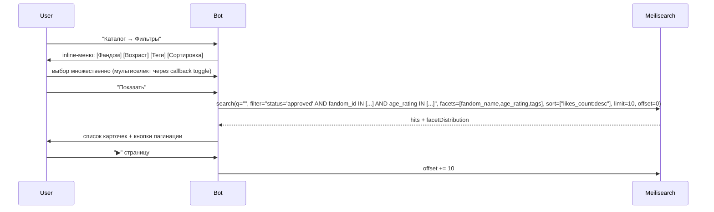

### 6b. Через инлайн-режим

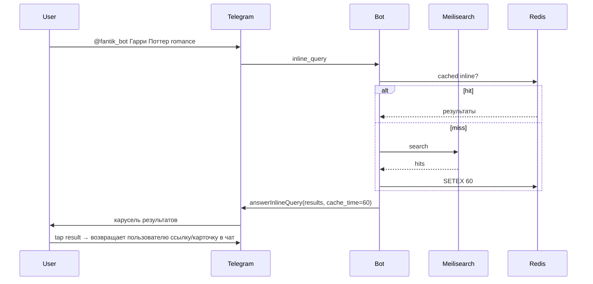

---

## 7. Подписка на автора

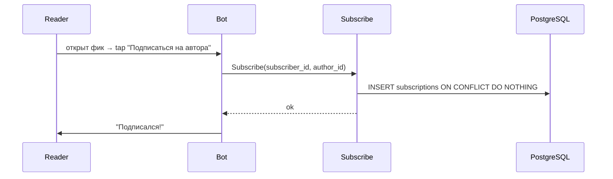

### Уведомление о новой главе/работе

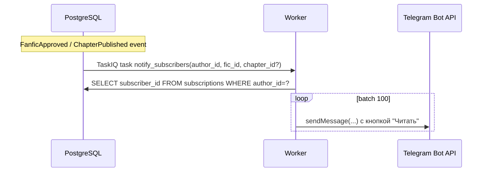

Частота: без rate-limit глобально (новая работа — редкое событие), но с локальным throttle 25 msg/s для защиты от hit лимита TG.

---

## 8. Жалоба

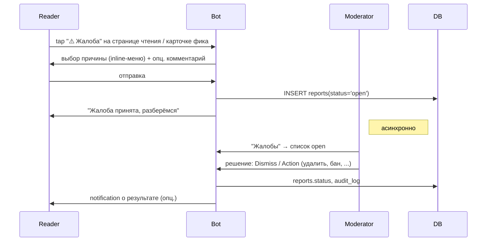

---

## 9. Админская статистика

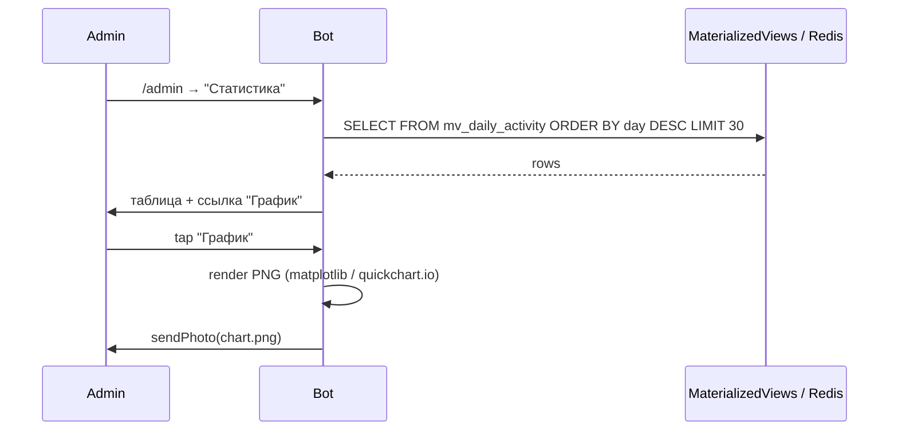

Доступные дашборды:
- Ежедневная активность (starts, regs, first_read, first_publish) за 30/90 дней.
- Retention cohort (DAU, W1, W2, M1).
- Воронка по UTM-коду.
- Топ фандомов / авторов.
- Нагрузка модераторов.

---

## 10. Админские рассылки

См. подробный флоу в [`07-broadcast-system.md`](07-broadcast-system.md). Здесь — короткий user-level:

1. `/admin → Рассылки → Новая`.
2. Бот просит отправить/переслать сообщение-шаблон.
3. Бот сохраняет `source_message_id`, показывает превью через `copyMessage` обратно админу.
4. Админ добавляет inline-кнопки (wizard).
5. Админ выбирает сегмент из пресетов или описательно.
6. Админ выбирает время (сразу / отложенно).
7. Бот показывает финальное превью: «будет отправлено N пользователям, старт в HH:MM UTC+3. Запустить?»
8. Запуск → scheduler/worker.

---

## 11. Деплинки внутри бота (ссылки на фик)

Генерация: `t.me/<bot>?start=fic_<id>`. При получении — `/start fic_42` — бот открывает карточку фика 42.

Кейсы использования:
- Поделиться фиком другу.
- Внутренняя кнопка «Поделиться» в карточке фика — копирует ссылку.

Валидация — формат `fic_<int>`.
