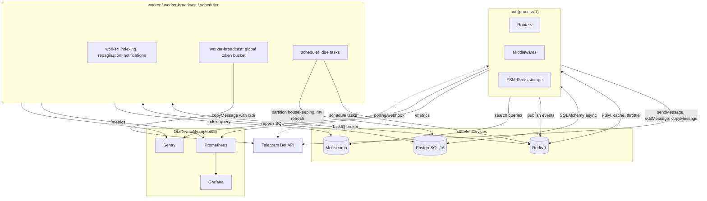

# Диаграмма компонентов

## Потоки

- **Апдейты от пользователей**: Telegram → bot (polling или webhook). Бот быстро отвечает и ставит тяжёлое в TaskIQ.
- **Фоновые задачи**: worker читает из Redis broker, обрабатывает (индексация в Meili, сохранение в PG, отправка уведомления).
- **Рассылки**: отдельный пул `worker-broadcast` с глобальным rate-limit в Redis.
- **Scheduler**: чистит протухшие локи, создаёт партиции, рефрешит materialized views, запускает отложенные рассылки.
- **Наблюдаемость**: Prometheus скрапит метрики с каждого процесса; Grafana строит дашборды; Sentry собирает ошибки.

## Масштабирование

- `bot` при переключении на webhook — горизонтально, за Nginx.
- `worker`, `worker-broadcast` — произвольное число реплик (TaskIQ распределяет).
- `scheduler` — **один активный** (Redis-lock `scheduler:leader:*`).
- `PG`, `Redis`, `Meili` — можно переехать в managed без изменения кода.
