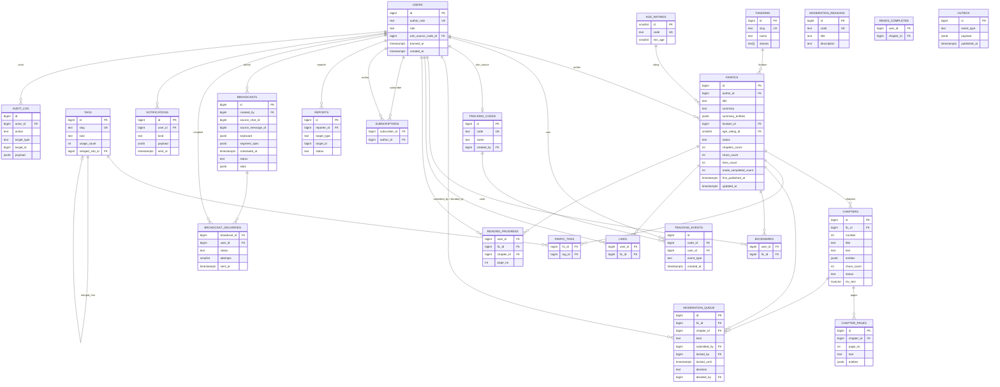

# ERD (упрощённо)

```mermaid
erDiagram
    USERS {
        bigint id PK
        text author_nick UK
        text role
        bigint utm_source_code_id FK
        timestamptz banned_at
        timestamptz created_at
    }
    TRACKING_CODES {
        bigint id PK
        text code UK
        text name
        bigint created_by FK
    }
    TRACKING_EVENTS {
        bigint id
        bigint code_id FK
        bigint user_id FK
        text event_type
        timestamptz created_at
    }
    FANDOMS {
        bigint id PK
        text slug UK
        text name
        text[] aliases
    }
    AGE_RATINGS {
        smallint id PK
        text code UK
        smallint min_age
    }
    TAGS {
        bigint id PK
        text slug UK
        text kind
        int usage_count
        bigint merged_into_id FK
    }
    FANFICS {
        bigint id PK
        bigint author_id FK
        text title
        text summary
        jsonb summary_entities
        bigint fandom_id FK
        smallint age_rating_id FK
        text status
        int chapters_count
        int chars_count
        int likes_count
        int reads_completed_count
        timestamptz first_published_at
        timestamptz updated_at
    }
    FANFIC_TAGS {
        bigint fic_id FK
        bigint tag_id FK
    }
    CHAPTERS {
        bigint id PK
        bigint fic_id FK
        int number
        text title
        text text
        jsonb entities
        int chars_count
        text status
        tsvector tsv_text
    }
    CHAPTER_PAGES {
        bigint id PK
        bigint chapter_id FK
        int page_no
        text text
        jsonb entities
    }
    MODERATION_QUEUE {
        bigint id PK
        bigint fic_id FK
        bigint chapter_id FK
        text kind
        bigint submitted_by FK
        bigint locked_by FK
        timestamptz locked_until
        text decision
        bigint decided_by FK
    }
    MODERATION_REASONS {
        bigint id PK
        text code UK
        text title
        text description
    }
    BOOKMARKS {
        bigint user_id FK
        bigint fic_id FK
    }
    LIKES {
        bigint user_id FK
        bigint fic_id FK
    }
    READS_COMPLETED {
        bigint user_id FK
        bigint chapter_id FK
    }
    READING_PROGRESS {
        bigint user_id FK
        bigint fic_id FK
        bigint chapter_id FK
        int page_no
    }
    SUBSCRIPTIONS {
        bigint subscriber_id FK
        bigint author_id FK
    }
    REPORTS {
        bigint id PK
        bigint reporter_id FK
        text target_type
        bigint target_id
        text status
    }
    BROADCASTS {
        bigint id PK
        bigint created_by FK
        bigint source_chat_id
        bigint source_message_id
        jsonb keyboard
        jsonb segment_spec
        timestamptz scheduled_at
        text status
        jsonb stats
    }
    BROADCAST_DELIVERIES {
        bigint broadcast_id FK
        bigint user_id FK
        text status
        smallint attempts
        timestamptz sent_at
    }
    NOTIFICATIONS {
        bigint id PK
        bigint user_id FK
        text kind
        jsonb payload
        timestamptz sent_at
    }
    AUDIT_LOG {
        bigint id
        bigint actor_id FK
        text action
        text target_type
        bigint target_id
        jsonb payload
    }
    OUTBOX {
        bigint id PK
        text event_type
        jsonb payload
        timestamptz published_at
    }

    USERS ||--o{ FANFICS : "author"
    USERS ||--o{ TRACKING_EVENTS : "user"
    TRACKING_CODES ||--o{ TRACKING_EVENTS : "code"
    USERS ||--o| TRACKING_CODES : "utm_source"
    FANDOMS ||--o{ FANFICS : "fandom"
    AGE_RATINGS ||--o{ FANFICS : "rating"
    FANFICS ||--o{ CHAPTERS : "chapters"
    CHAPTERS ||--o{ CHAPTER_PAGES : "pages"
    FANFICS ||--o{ FANFIC_TAGS : ""
    TAGS ||--o{ FANFIC_TAGS : ""
    TAGS ||--o| TAGS : "merged_into"
    FANFICS ||--o{ MODERATION_QUEUE : ""
    CHAPTERS ||--o{ MODERATION_QUEUE : ""
    USERS ||--o{ MODERATION_QUEUE : "submitted_by / decided_by"
    USERS ||--o{ BOOKMARKS : ""
    FANFICS ||--o{ BOOKMARKS : ""
    USERS ||--o{ LIKES : ""
    FANFICS ||--o{ LIKES : ""
    USERS ||--o{ READING_PROGRESS : ""
    FANFICS ||--o{ READING_PROGRESS : ""
    USERS ||--o{ SUBSCRIPTIONS : "subscriber"
    USERS ||--o{ SUBSCRIPTIONS : "author"
    USERS ||--o{ REPORTS : "reporter"
    USERS ||--o{ BROADCASTS : "admin"
    BROADCASTS ||--o{ BROADCAST_DELIVERIES : ""
    USERS ||--o{ BROADCAST_DELIVERIES : "recipient"
    USERS ||--o{ NOTIFICATIONS : ""
    USERS ||--o{ AUDIT_LOG : "actor"
```

Полная схема, DDL и индексы — в [`../03-data-model.md`](../03-data-model.md).
