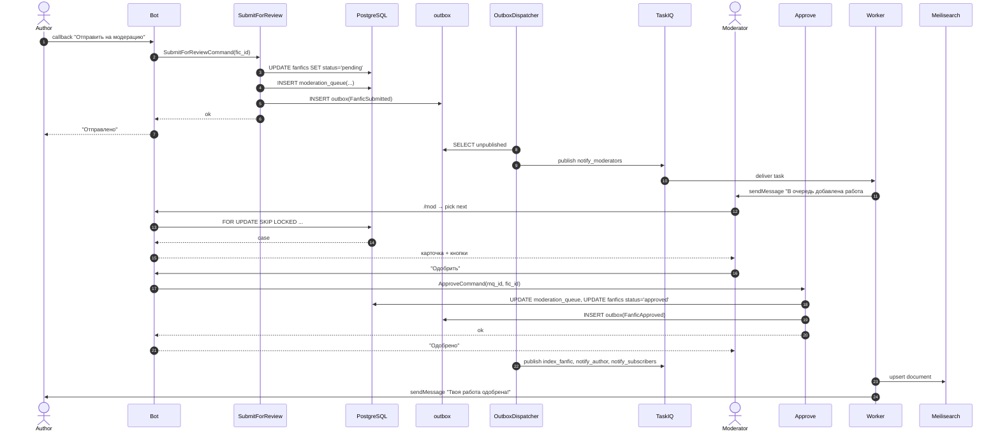
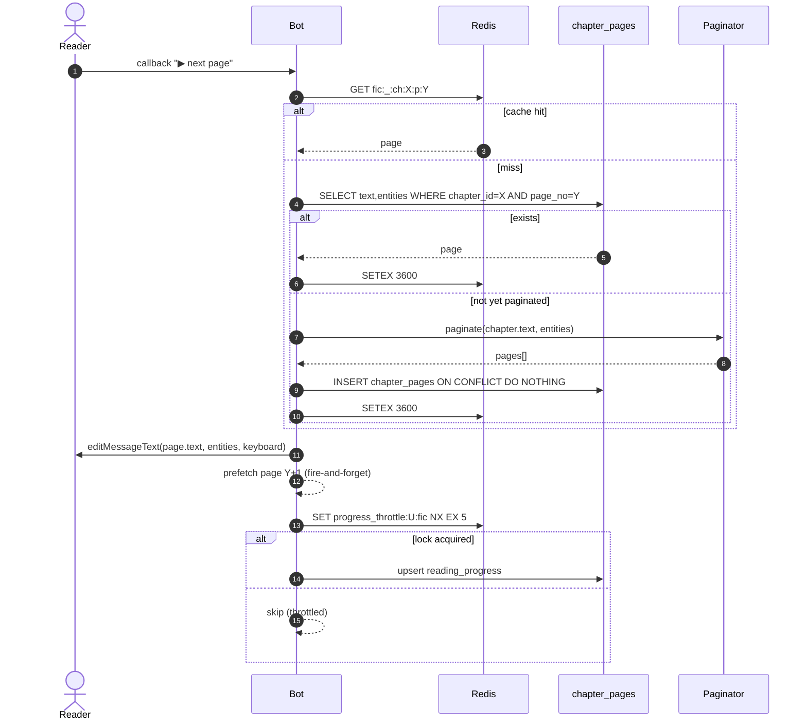
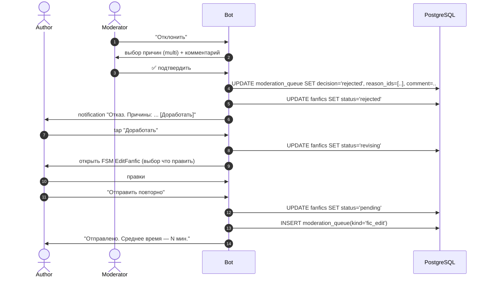
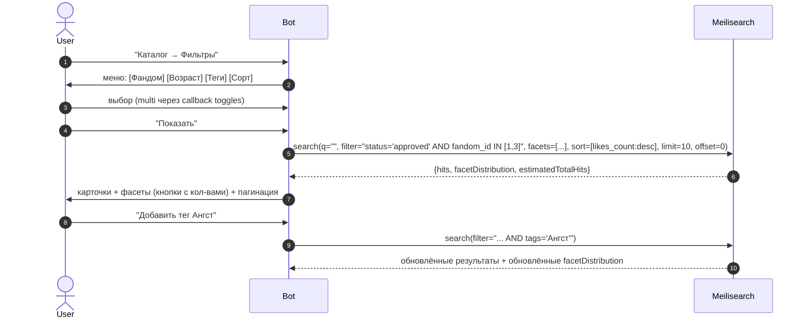
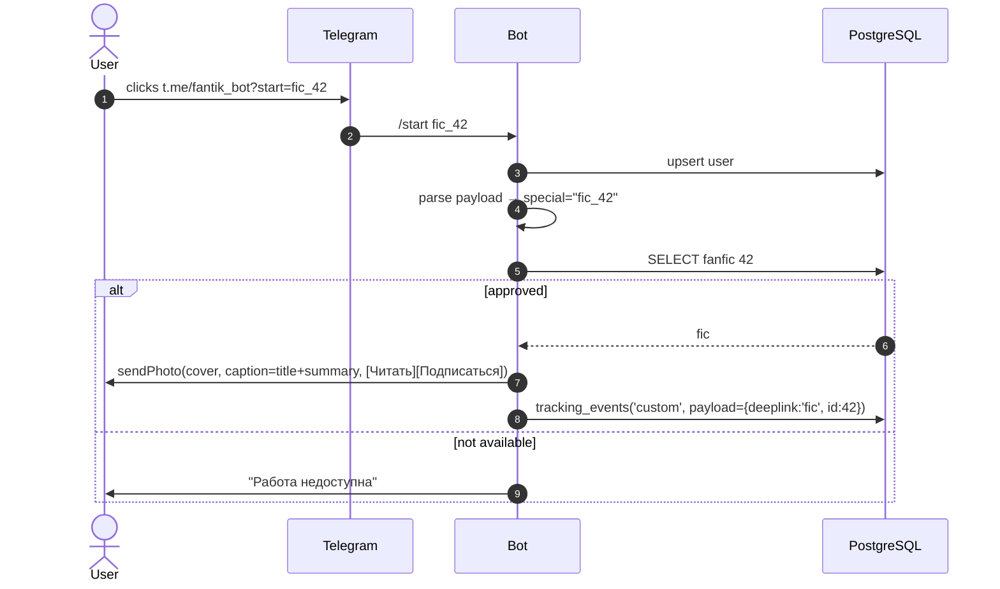

# Ключевые sequence-диаграммы

Все — в Mermaid; дублируют/углубляют сценарии из [`../05-user-flows.md`](../05-user-flows.md) и [`../07-broadcast-system.md`](../07-broadcast-system.md).

## 1. Публикация → модерация → индексация



---

## 2. Чтение страницы



---

## 3. Рассылка

```mermaid
sequenceDiagram
    autonumber
    actor Adm as Admin
    participant B as Bot
    participant FSM as FSM
    participant PG as PostgreSQL
    participant S as Scheduler
    participant WB as worker-broadcast
    participant RL as RateLimiter (Redis)
    participant TG as Telegram

    Adm->>B: /broadcast
    B->>FSM: set state waiting_source
    Adm->>B: forwards template message
    B->>PG: INSERT broadcasts (source_chat, source_msg, status='draft')
    B->>TG: copyMessage back to admin (preview)
    Adm->>B: + inline keyboard
    B->>PG: UPDATE broadcasts SET keyboard=...
    Adm->>B: + segment (e.g. active_7d)
    B->>PG: UPDATE broadcasts SET segment_spec=...
    Adm->>B: + scheduled_at (tomorrow 10:00)
    B->>PG: UPDATE broadcasts SET scheduled_at=..., status='scheduled'

    Note over S: cron tick каждую минуту
    S->>PG: SELECT due scheduled FOR UPDATE SKIP LOCKED
    S->>PG: UPDATE status='running'
    S->>WB: enqueue run_broadcast(id)

    WB->>PG: stream user_ids in batches of 1000
    WB->>PG: INSERT broadcast_deliveries ON CONFLICT DO NOTHING
    WB->>WB: schedule deliver_one(bc_id, user_id) × N

    loop каждый deliver_one
        WB->>RL: acquire "broadcast:global" 25/s
        RL-->>WB: ok
        WB->>TG: copyMessage(user_id, source_chat, source_msg, kb)
        alt sent
            TG-->>WB: message_id
            WB->>PG: UPDATE delivery SET status='sent'
        else 429
            TG-->>WB: retry_after=5
            WB->>WB: sleep 5s; retry (без attempt++)
        else 403 blocked
            TG-->>WB: Forbidden
            WB->>PG: UPDATE delivery SET status='blocked'
        else error
            WB->>PG: attempts++ ≤3 requeue; >3 failed
        end
    end

    WB->>PG: UPDATE broadcasts status='finished', stats={...}
    WB->>TG: sendMessage to admin "Рассылка завершена: ..."
```

---

## 4. Отказ и повторная отправка



---

## 5. Поиск с фасетами



---

## 6. Онбординг с UTM и deep-link на фик



---

## 7. Жалоба

```mermaid
sequenceDiagram
    autonumber
    actor U as Reader
    actor M as Moderator
    participant B as Bot
    participant PG as PostgreSQL

    U->>B: "⚠️ Жалоба" на странице
    B->>U: меню причин + опц. коммент
    U->>B: отправка
    B->>PG: INSERT reports(status='open')
    B->>U: "Жалоба принята"
    M->>B: /mod → "Жалобы"
    B->>PG: SELECT open reports
    B->>M: список + карточка
    M->>B: "Удалить работу"
    B->>PG: UPDATE fanfics SET status='archived'; UPDATE reports SET status='actioned'
    B->>U: notify "По твоей жалобе приняли меры"
    B->>Author: notify "Работа снята с публикации: <причина>"
```
